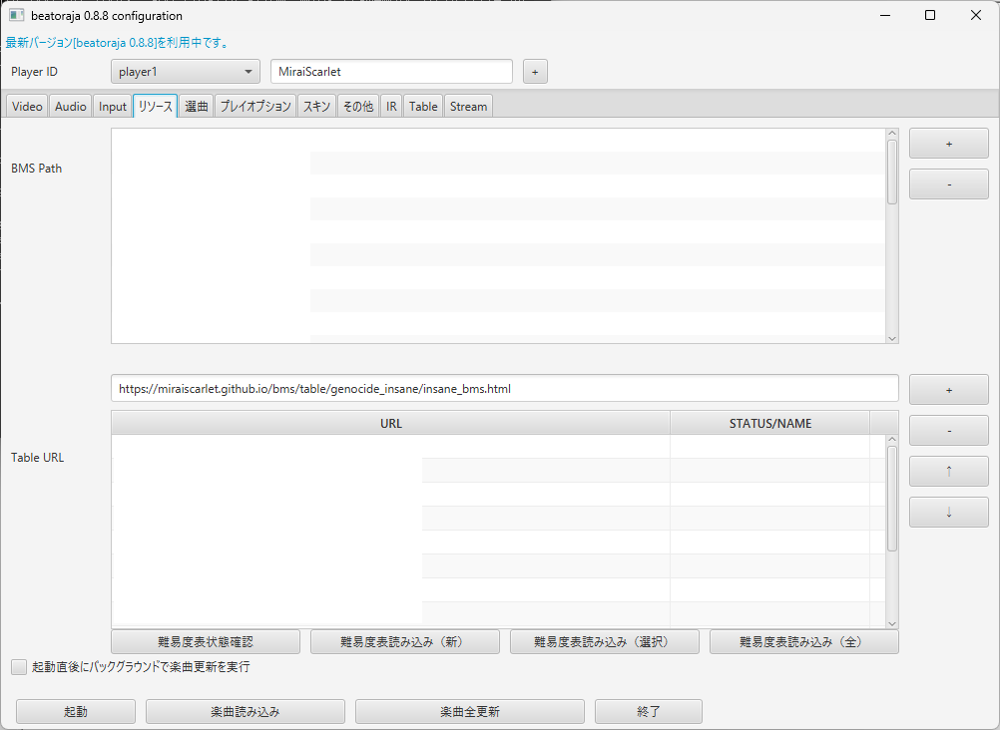

# Mirai'S Station github side

 色々置き場
 
 現状はBMS難易度表関連のみ

# 発狂BMS難易度表(次期難易度表フォーマット対応)

 beatoraja系本体、及びGLAssist/BeMusicSeeker等の次期難易度表フォーマットを使用したツールでの読込に対応した難易度表テーブルファイル

 以下のURLを使用するツールに追加してください。

 **https://miraiscarlet.github.io/bms/table/genocide_insane/insane_bms.html**

 ex.beatorajaの場合

 リソース→「Table URL」の部分にURLをコピー&ペースト→「+」追加→難易度表読込

 