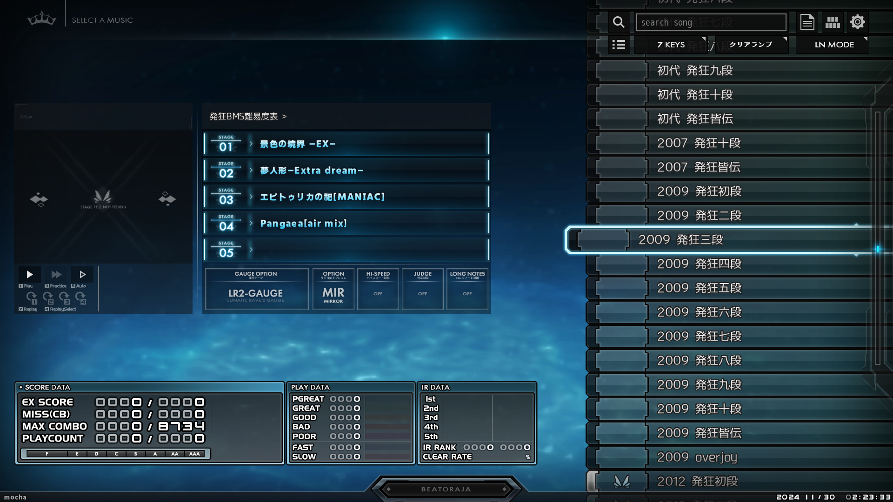

# Mirai'S Station github side

 色々置き場
 
 現状はBMS難易度表関連のみ

# 次期難易度表フォーマット対応 難易度表テーブル

 beatoraja系本体、及びGLAssist/BeMusicSeeker等の次期難易度表フォーマットを使用したツールでの読込に対応した難易度表テーブルファイル

 以下のURLを使用するツールに追加してください。

 __発狂BMS難易度表(GENOCIDE)__

 **https://miraiscarlet.github.io/bms/table/genocide_insane/insane_bms.html**

上記難易度表はおまけとして、コース定義部分に現在の発狂段位(2018)に加えて、**過去の発狂段位コース(初代・2007(十段・皆伝のみ)・2009・2012)を登録してあります**

 

※歴代曲目リストは[こちらを参照させて頂いております。](https://docs.google.com/spreadsheets/d/1SxcKTFUPEi_b1E_bQsv_NgPWOyvUZjJ9BG3jg6sY73o/edit?gid=27669095#gid=27669095) この場を借りてお礼申し上げます。

※2007(?)の違いは十段と皆伝のみで他は初代と同じのようなので、十段皆伝以外のコースは登録してありません。

　また情報が不足しているため相違があるかもしれません、もし相違があればIssueでお知らせください。

※設定は全てMIRROR可・LR2段位ゲージです。

　特に初代はLR2が無かった時代の段位の為、雰囲気重視でお楽しみ頂ければ幸いです。

 ex.beatorajaの場合

 リソース→「Table URL」の部分にURLをコピー&ペースト→「+」追加→難易度表読込

 

# 謝辞

以下のファイルは両替侍様のサンプルファイルを使用しております。

難易度表スタイルシート _/bms/table/style.css_

ライブラリ _/bms/table/jquery-2.0.2.min.js_